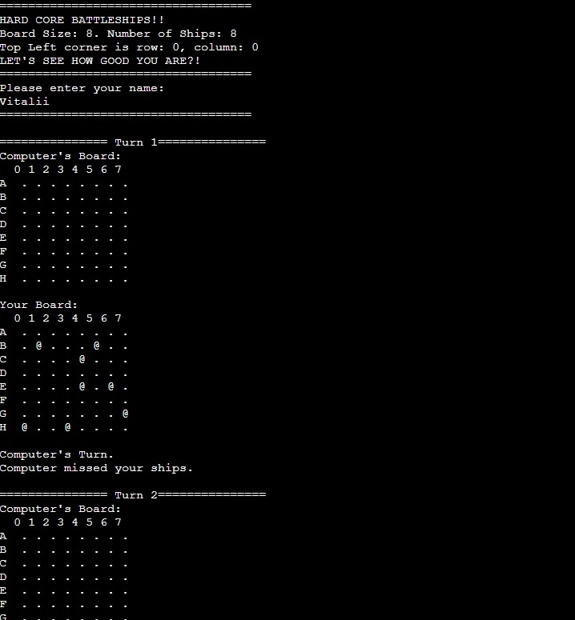
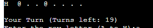
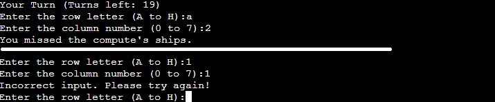
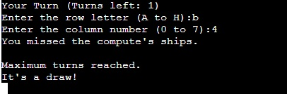

# Hardcore Battleships

Embark on an engaging matitime adventure with our meticulously crafted Battleships game.
Sink your adversary's ships while protecting your own in this classic naval battle.
Experience the thrill of outsmatring your opponent with every move, aiming for victory within 20 intense turns.
Immerse yourselft in the battle, strategize wisely, and relish the excitement of being crowned the ultimate sea commander!

Game link here! ===> [HardCore BattleShips!](https://hardcorebattleships-92d1b8be4b51.herokuapp.com/)

# How to Play

Set Up the Game:

The game is played on a grid board, where each player has their own fleet of ships hidden from their opponent.
The grid is labeled with letters for rows (A to H) and numbers for columns (0 to 7).

Taking Turns:

Players take turns making guesses by selecting a target on their opponent's board.
Guesses are made by entering a row letter (A to H) and a column number (0 to 7).

Guessing and Results:

After making a guess, the result is revealed:
If the guess hits an opponent's ship, the hit is marked with an "*".
If the guess misses all ships, the miss is marked with an "X".

Winning the Game:

The game continues until one of the following conditions is met:
A player sinks all of their opponent's ships first.
Both players have taken a maximum of 20 turns.

Determining the Winner:

If a player sinks all of their opponent's ships, they win the game.
If 20 turns are completed and no player has won, the player with the higher score wins.
Scores are based on the number of hits on the opponent's ships.

Playing Again:

After the game ends, players can reset the boards and start a new game.
The excitement of each game lies in the strategic choices and the thrill of the unknown.

# Features

<ul>
    <li>Random Board Generation:
        <ol>
            <li>Ships are randomly placed on both the player and computer boards.
            <li>The player cannot see where computer's ships are.
            <li>The boards generate every turn, either player's or computer's.
            <li>Each turn indicated on top of the boards.
        </ol>
</ul>

<ul>
    <li>Indicator for Turns:
        <ol>
            <li>Shows how many turns player have in total.
            <li>Turns are shared with the computer.
            <li>Each turn player or computer takes it brings the amount of turns down.
        </ol>
</ul>

<ul>
    <li>Input validation:
        <ol>
            <li>You cannot enter coordinates outside of the grid.
            <li>For row: you must enter a letter.
            <li>For column: you must enter a number.
            <li>Unless you will get error message : "Incorrect input. Please try again!
        </ol>
</ul>

<ul>
    <li>End of game:
        <ol>
            <li>Depends on the score of player or computer, the end of game results as follows.
            <li>"Computer wins the game!"
            <li>"Congratulations! You win the game!"
            <li>"It's a draw!"
            <li>It will also indicate the maximum turns has been reached. 
        </ol>
</ul>

# Future Features

<ul>
    <li>Allow player to position their own ships.
    <li>Have ships larger then 1x1.
</ul>

# Data Model

I decided to use Board class as my model. The game creates two instances of the Board class to hold the player's and 
the computer's board.

The Board class stores the board size, ships, the position of hte ships, the guesses against the board,
and details such as the board type (player's board or computer) and the player's name.

The class also has methods to help play the game, such as <strong>print</strong> method to print out the current board,
an <strong>add_ships</strong> method to add ships to the board and an <strong>guess</strong> method to add a guess and return the result.

# Testing

I have manually tested this project by doing the followin:
<ul>
    <li>Tested via PEP8 linter and confirmed there are no problems.
    <li>Given invalid inputs.
    <li>Tested in my local terminal and the Code Institute Heroku Terminal.
</ul>

# Bugs

## Solved Bugs

<ul>
    <li>When i wrote the project, I was getting index errors because I forgotten to add and argument to functions <strong>def guess, def print</strong>.
    <li>Also forgot to add function call for <strong>play_game()</strong> in <strong>new_game</strong> function.
</ul>

## Remaining Bugs

<ul>
    <li>No bugs remaining.
</ul>

## Validator Testing

PEP8
<ul>
    <li>Only these errors had occure but I didn't take it into consideration, since I didn't have several files open side-by-side.
    <li>It does not have any impact on the game itself.
    <li>110: E501 line too long (83 > 79 characters)
    <li>123: E501 line too long (104 > 79 characters)
</ul>

# Deployment

This project was deployed using Code Institute's mock terminal for Heroku.

<strong>Steps for deployment:</strong>

-Fork or clone this repository

-Create a new Heroku app

-Set the buildbacks to <h3>Python</h3> and <h3>NodeJS</h3> in that order.

-Link the Heroku app to the repository

-Click on Deploy

# Credits

-Code Institute for the deployment terminal.

-Wikipedia for the details of the Battleships game.